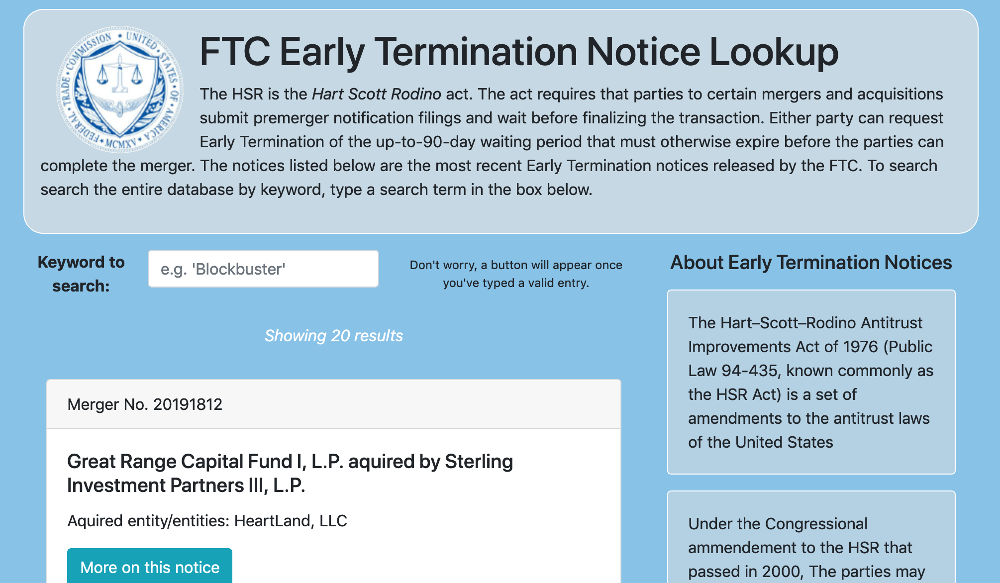

# FTC Early [Merger Clearance] Nofitication Lookup
### ⚠️ Disclaimer ⚠️

This app includes summaries of what I believe to be the general gist of FTC guidance on the terminology and concepts related to the [Early Notifications API](https://www.ftc.gov/developer/api/v0/endpoints/hsr-early-termination-notices). I read at [this page,](https://www.ftc.gov/enforcement/premerger-notification-program) [this page](https://www.ftc.gov/enforcement/premerger-notification-program/early-termination-notices/about-early-termination-notices), and [this blog post](https://www.ftc.gov/news-events/blogs/competition-matters/2017/08/getting-sync-hsr-timing-considerations). I have exactly *NO* legal training, and I did not do any legally viable verification of these summaries. **Trust/interpret summaries with caution** -- this is a purely a development demonstration. 




## Getting Started

These instructions will help you get a copy of the project up and running on your local machine for development and testing purposes.

### Before you dive in...

This app doesn't ship with it's own database. Instead, it uses an external API request.  To bypass cross-origin request issues in the browser, a really (*really*) simple Express API handles this request for us. The API is offered by Data.Gov, so you'll need a working API key to make these requests work. 

Request Keys, Node environment settings, and the application port are all set in a `.env` file. Run

```
cp .envexample .env
```

to create your own .env file to store your keys. Then, replace the values as needed. The rest of these instructions assume you've left your port value at `9000` but, you can substitute another port if you are so inclined.

### Installing

First, download or clone this repository: 

```
git clone git@github.com:dianafreeman/FTC-merger-notification-lookup.git 
```

Then, install dependencies: 

```
npm i 
```

To run the API server, execute the command

```
npm run server
```

**Checkpoint!**  Open Postman, or any other API testing environment, and navigate to `http:/localhost:9000/data`. You should get a JSON response. 


**To run the server and launch the app in one fell swoop,** you can run 

```
npm run everything
```


## Automated Tests

Run `npm run test` to run the API Endpoint Tests.

These tests focus on the API proxy for the FTC API. It includes a test-of-a-test, to ensure that testing is properly configured. You should see the following results;

```
  a Test of a Test
    ✓ should shoud timeout and succeed

  Server Actions
    get /data
      ✓ res.body.data should be an array of objects (238ms)
    search for /term
      ✓ search results should be early termination notices (123ms)
    search /term
      ✓ search results should include search term (147ms)


  4 passing (520ms)
```


### Directory Structure

```
-- dist  					  // Build Directory -- static target for Express Router
		- index.html   	// main browser file
		- main.css    	// main style file
		- main.js   	  // main script file
		
-- src						  // Dev Directory
		-- components   // React Components that change with app State
		-- elements 		// Styled Components
		-- scss					// Declared Styles
		- index.js      // Where the Magic happens (jk. The main script)
		
-- test						  // Test Directory
	-- index.js       // test the testing feature
	-- NoticeObj.spec.js // What each response array object should
	-- server.spec.js // tests server calls for good measure
	-- setup 					// stop mocha from yelling about React Components
	
-.babelrc						// Babel Config
-.env/.envexample		// Key Config
-.gitignore 
-.eslintrc.js 			// EsLint Config
- Gruntfile.js 			// Grunt Config
- package.json
- server.js 				// Server for API Proxy 	
- README.md
```


## Built With

* [ExpressJS](https://expressjs.com/) - Express JS -- proxy server to fetch/receive external API requests
* [ReactJS](https://reactjs.org/) - React 
* [SimpleBar](https://github.com/Grsmto/simplebar) - Cross-browser styling of scrollbar css for synthetic scroll environments
* [Styled Components](https://www.styled-components.com/) -- add styles directly to React Components
* [Mocha](https://mochajs.org/) - Testing Framework
* [Chai](https://www.chaijs.com/api/) -- Assertion library for testing
* [Enzyme](https://airbnb.io/enzyme/) -- Test React Components
* [PropTypes](https://reactjs.org/docs/typechecking-with-proptypes.html) - Typechecking for react


